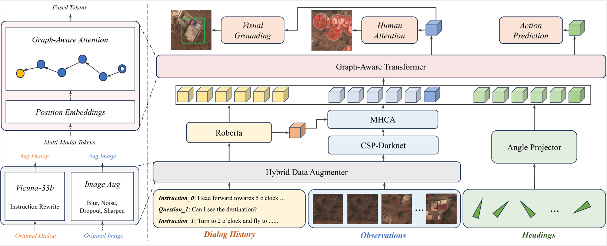

# TG-GAT for AVDN.

**Official Code for the 1st Place Solution of ICCV CLVL 2023 AVDN Challenge**. 

The corresponding technical report is [Target-Grounded Graph-Aware Transformer for Aerial Vision-and-Dialog Navigation](https://arxiv.org/abs/2308.11561). 



You can check the specific details of the AVDN competition on the [official website](https://sites.google.com/view/aerial-vision-and-dialog/avdn-challenge?authuser=0), and the leaderboard results can be viewed at [evalai](https://eval.ai/web/challenges/challenge-page/2049/leaderboard/4850).


## Abstract

This report details the method of the winning entry of the AVDN Challenge in ICCV CLVL 2023. The competition addresses the Aerial Navigation from Dialog History (ANDH) task, which requires a drone agent to associate dialog history with aerial observations to reach the destination. For better cross-modal grounding abilities of the drone agent, we propose a Target-Grounded Graph-Aware Transformer (TG-GAT) framework. Concretely, TG-GAT first leverages a graph-aware transformer to capture spatiotemporal dependency, which benefits navigation state tracking and robust action planning. In addition, an auxiliary visual grounding task is devised to boost the agent’s awareness of referred landmarks. Moreover, a hybrid augmentation strategy based on large language models is utilized to mitigate data scarcity limitations. Our TG-GA framework won the AVDN Challenge, with 2.2% and 3.0% absolute improvements over the baseline on SPL and SR metrics, respectively. 

For AVDN task,  we recommend referring to the original [AVDN paper](https://arxiv.org/abs/2205.12219) for more detailed information.


## TODOs

- [x] LLM-augmented instruction data;
- [x] Code with support for multi-GPU training;
- [x] Trained logs;
- [ ] Trained models;


## Prerequisites

#### Installation

We utilized the same environment as the [AVDN baseline](https://github.com/eric-ai-lab/Aerial-Vision-and-Dialog-Navigation).

```bash
pip install torch==1.11.0+cu113 -f https://download.pytorch.org/whl/torch_stable.html
pip install torchvision==0.12.0+cu113 -f https://download.pytorch.org/whl/torch_stable.html
pip install -r requirements.txt
```


#### Dataset Download

1. Please download the xView dataset from [https://challenge.xviewdataset.org/data-download](https://challenge.xviewdataset.org/data-download).
2. Please download the ANDH dataset from [https://sites.google.com/view/aerial-vision-and-dialog/home](https://sites.google.com/view/aerial-vision-and-dialog/home).
3. Please download the converted xView-pretrained Yolov5x backbone weight from [here](https://drive.google.com/file/d/1G3m2KTKt3EWnvR24d5fZlLnjisADzkzp/view?usp=drive_link). Or you can obtain the complete weights from [https://huggingface.co/deprem-ml/Binafarktespit-yolo5x-v1-xview](https://huggingface.co/deprem-ml/Binafarktespit-yolo5x-v1-xview) and personally load them into the network.
4. Please download our LLM-augmented instructions dataset using Vicuna-33b from  [here](https://drive.google.com/file/d/1fUII6iBEoZXZO72j1WOqIefl77h6EtTr/view?usp=drive_link). Alternatively, you can use [FastChat](https://github.com/lm-sys/FastChat) to personally enhance training instructions.

After downloading the aforementioned data, please organize the entire project according to the following structure:

```
project_root/
├── datasets/
│   ├── AVDN/
│   │   ├── annotations(ANDH dataset here)
│   │   ├── pretrain_weights(pretrained weights here)
│   │	├── train_iamges(xView images here)
│	│	│── ...
│
├── readme_imgs/
│   ├── ...
│
├── src/
│   ├── prj_1/
│   │   ├── ...
│   │
│   ├── prj_2/
│   │   ├── ...
│
├── README.md
├── requirements.txt
```


## Training logs

We present training logs corresponding to the 4 models under the 'src' directory in our implementation.

|               **Model**               | **SPL** | **SR** | **GP** | logs |
| :-----------------------------------: | :-----: | :----: | :----: | :----: |
|                 imga                  |  16.9   |  20.2  |  51.9  | [logs.txt](tg-gat-logs/imga.txt) |
|              imga+langa               |  18.2   |  20.9  |  58.2  | [logs.txt](tg-gat-logs/imga+langa.txt) |
|  imga+mhca+gr+roberta+yolov5x   |  18.8   |  23.3  |  54.3  | [logs.txt](tg-gat-logs/imga+mhca+gr+roberta+yolov5x.txt) |
| img+mhca+gr+roberta+yolov5x+gat |  18.4   |  22.6  |  58.1  | [logs.txt](tg-gat-logs/imga+mhca+gr+roberta+yolov5x+gat.txt) |


## Running

To train and validate the model, you need to navigate to the specific model directory within the 'src' folder. Taking the 'et_imga' model as an example, you can run the following command for running.

```
cd src/0_et_imga
bash train.sh
```


## Acknowledgment

We thank the developers of [AVDN](https://github.com/eric-ai-lab/Aerial-Vision-and-Dialog-Navigation) and [DUET](https://github.com/cshizhe/VLN-DUET) for their public code release.


